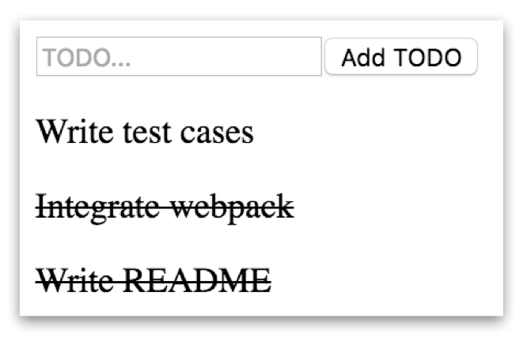
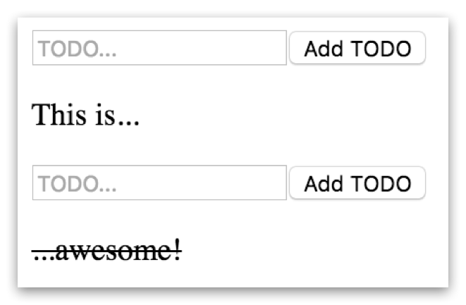

# TODOit&trade;
_The_ JavaScript framework for hassle-free TODO application development.

### Why a TODO app-framework?
In modern app development, TODO apps are everywhere. The Internet is full of 
[countless](https://parse.com/tutorials/todo-app-with-javascript) 
[tutorials](https://www.sitepoint.com/building-list-jquery-local-storage/) 
[on](https://www.playframework.com/documentation/2.2.x/JavaTodoList) 
[how](http://thejackalofjavascript.com/mean-stack-hands-on-tutorial/) 
[to](https://www.sitepoint.com/starting-android-development-creating-todo-app/)
develop them. Implementing a TODO app is the ultimate, the landmark achievement for [any web app framework](http://www.todomvc.com). And rightly so - who doesn't have TODOs?

But existing frameworks make writing TODO apps way too hard for developers. Just consider the following stats on some common implementations:

  - [A React/Redux TODO app](http://redux.js.org/docs/basics/ExampleTodoList.html) - 13 JS files, nearly 300 lines of code
  - [Angular 2 TODO app](https://github.com/davideast/ng2do): nearly 80 lines of code
  - [Mithril TODO app](http://jsfiddle.net/milesmatthias/fbgypzbr/1/) - nearly 70 lines of code
  - [Aurelia TODO app](https://github.com/mhoyer/todomvc-aurelia) - 5 JS files, 2 HTML files, nearly 270 lines of code

That's a whole lot of code! And on top of that, developers of a typical TODO app also have to deal with obscure things like views, state, or different types of HTML tags. Just think how much time it took to build all of [these 64 TODO apps](http://todomvc.com/)! 

In 2016, can't we do better? The answer is **yes** - with TODOit&trade;.

### Introducing TODOit&trade;
TODOit&trade; is a JavaScript framework that takes the hassle out of writing TODO apps. 
Just require the library from your website:

    

And then hook up your TODOit&trade; app in an HTML-element with _a single line of code_ to get going:

    TODOit('#some-element-id')

As a result, you will see a this beauty:

That's all it takes to write your TODO app with TODOit&trade;! Even compared to the next best framework Mithril, that's a **factor 70 productivity increase**!

Even better, you can have multiple TODO apps on the same page, making multi-tasking a breeze:

    TODOit('#one-element-id')
    TODOit('#another-element-id')

...resulting in this:

### TODOit&trade; design principles
To make this magic possible, TODOit&trade; is carefully built around the following principles:

  - **Reactive:** You just type your TODO and hit that button - TODOit&trade; will react!
  - **Immutable:** TODOit&trade; takes immutability to the next level: it is released in a production-ready version 1.0.0 and there will be no other versions in the future. Keeping the framework fixed means there will never be any (breaking) changes!
  - **Full stack:** TODOit&trade; apps cover the full stack - from creating TODOs to marking them done.
  - **Purely functional:** Write TODOs and mark them done. That's it. Form follows function.
  - **Convention over configuration:** TODOit&trade; does not provide any configuration options, making it literally a no-brainer to use. In addition, you don't have to learn any conventions.
  - **Zero-footprint API:** By providing no means to programmatically interact with a TODOit&trade; app, we are able to keep the API to a bare minimum. That adds to TODOit&trade;'s astonishingly steep learning curve. Also, you don't need to go through the kind of extensive documentation so many other frameworks require.
  - **Stateless:** TODOit&trade; apps avoid all the hassle associated with state. We achieve this by carefully avoiding to persist any data, anywhere. Doing so significantly reduces the developer's cognitive load.
  - **Microservice:** TODOit&trade; provides a competetivley small service.
  - **DevOps:** We leave the operation of the TODO app to you - the developer!
  - **Responsive:** We wrote TODOit&trade; from scratch to make sure it doesn't come with any styles. That means you can use a TODOit&trade; app in your responsive website - and it just works.
  - **Dependency-free:** Considering the recent [left-pad incident](http://www.theregister.co.uk/2016/03/23/npm_left_pad_chaos/), having as little dependencies as possible is key. TODOit&trade; has _zero_ runtime dependencies, making it resilient to any ecosystem shenanigans.
  - **Lightweight:** TODOit&trade; believes that you shouldn't make excessive assumptions about your users' mobile devices or data plans. Thus, the TODOit&trade; framework is only **0.95 kB** in size, making a perfect fit for mobile apps and the Internet of Things. Compare that to other frameworks (React 147 kB, Mithril 7.8 kB gzipped, Ember 461 kB... WITHOUT the application code)!
  - **Don't repeat yourself:** By not allowing you to delete TODOs, TODOit&trade; apps help users to remember what they did before, allowing them to stay DRY.
  - **Cutting edge:** TODOit&trade; makes use of the latest technological advances: it uses ES6 where possible and relies on webpack for fast builds.

On top of that, TODOis&trade; uses native JavaScript, runs in the cloud, and loves big TODO data.

### Try it
Just clone this repo and open `index.html` in the examples folder in any browser.

### Development
Install dependencies:

    npm install

Hack TODOit&trade;:

    webpack --progress --colors --watch

Finally, create a minified version:

    PROD_ENV=1 webpack --progress --colors

### License
TODOit&trade; can be used whenever wherever by whomever for whatever - in any way. Just TODO it.
